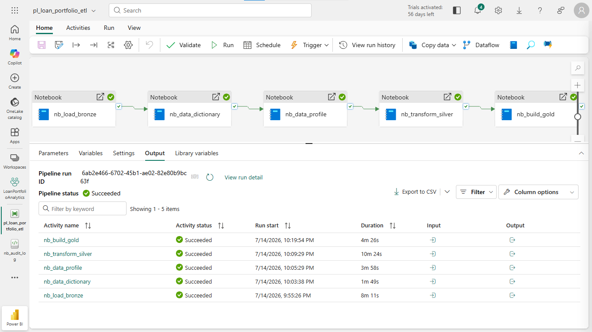
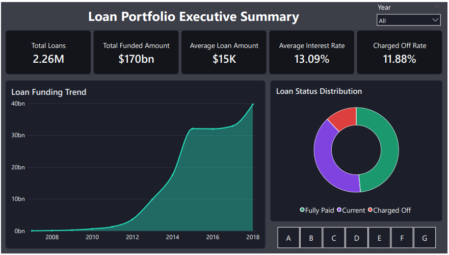
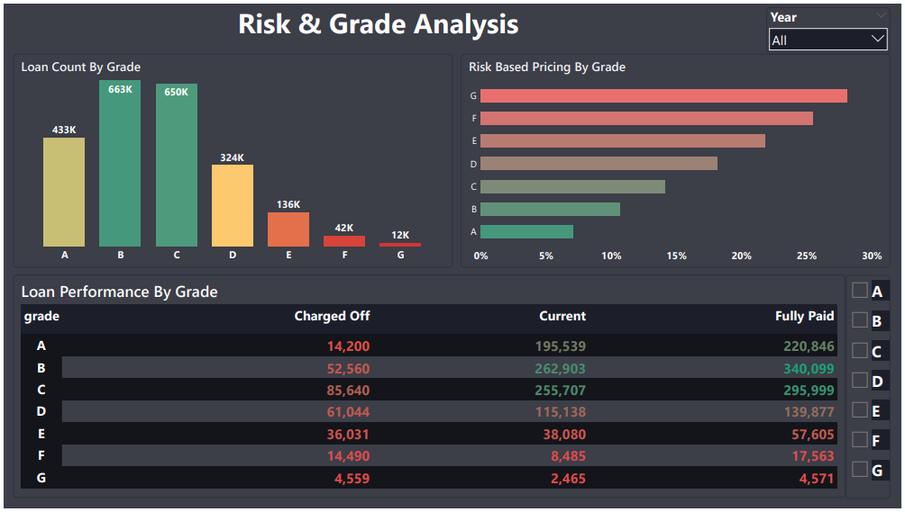
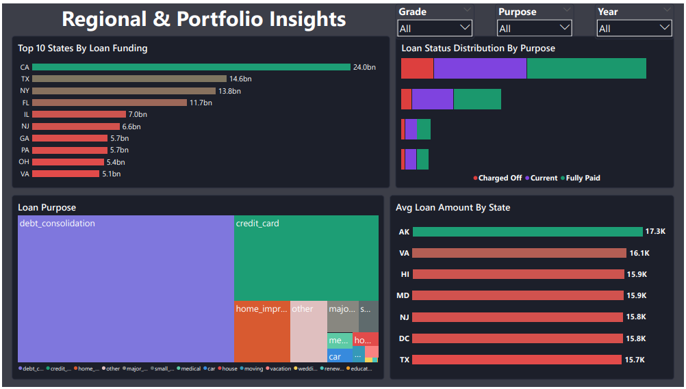
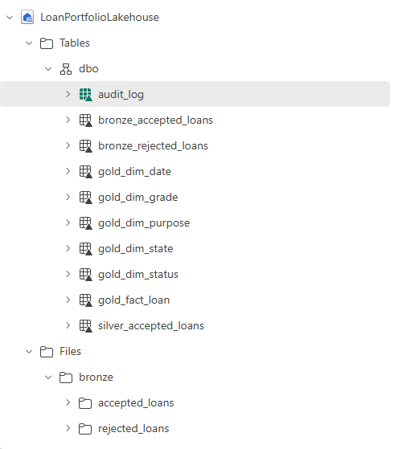
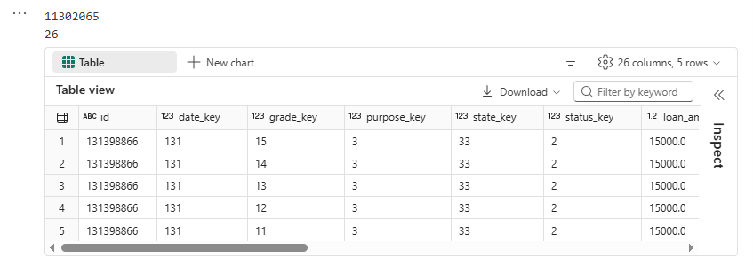
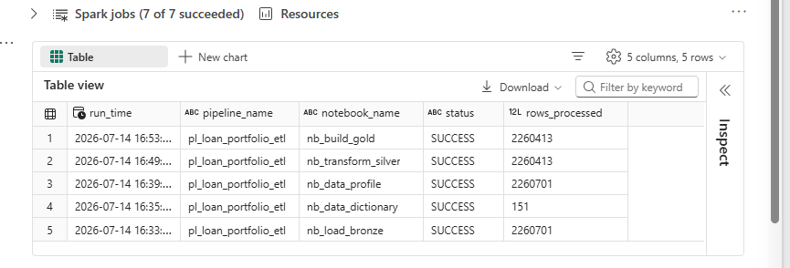
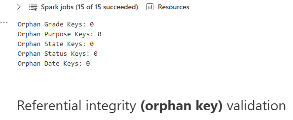
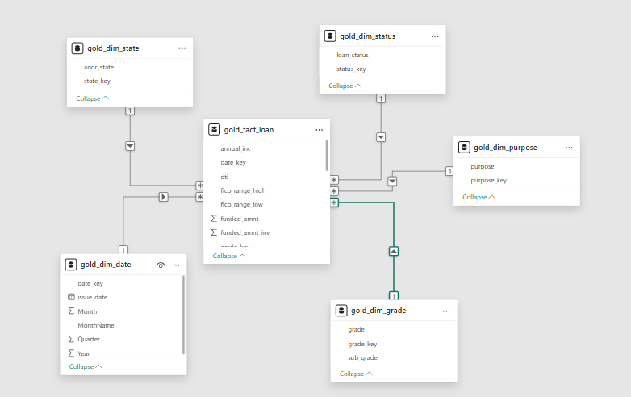

# 📊 Loan Portfolio Analytics using Microsoft Fabric

An end-to-end Data Engineering project built using **Microsoft Fabric**, implementing the **Medallion Architecture (Bronze → Silver → Gold)** to transform raw Lending Club loan data into an analytics-ready Star Schema for business reporting.

---

## 🚀 Project Overview

This project demonstrates a production-style data engineering workflow using Microsoft Fabric.

The pipeline ingests raw loan data into a Bronze layer, performs cleansing and validation in Silver, builds a dimensional model in Gold, and prepares the data for Power BI reporting.

---

## 🏗️ Architecture

<p align="center">
  
</p>


```text
                                                     Lending Club Loan Dataset
                                    accepted_2007_to_2018Q4.csv | rejected_2007_to_2018Q4.csv
                                                                │
                                                                ▼
                                                     🥉 Bronze Lakehouse
                                                  nb_load_bronze (PySpark)
                                                                │
                                       ┌────────────────────────┼────────────────────────┐
                                       ▼                        ▼                        ▼
                              nb_data_dictionary      nb_data_profile          Schema Validation
                                       │                        │
                                       └───────────────┬────────┘
                                                       ▼
                                            🥈 Silver Lakehouse
                                           nb_transform_silver
                                                       │
                                    ┌──────────────────┼──────────────────┐
                                    │                  │                  │
                                    ▼                  ▼                  ▼
                            Data Cleansing     Data Validation   Column Rationalization
                            • Type Casting     • Duplicate IDs   • 151 → 104 Columns
                            • Date Parsing     • Duplicate Rows
                            • Null Handling    • Domain Checks
                                                       │
                                                       ▼
                                              🥇 Gold Lakehouse
                                               nb_build_gold
                                                       │
                                ┌──────────────┬──────────────┬──────────────┐
                                ▼              ▼              ▼              ▼
                          gold_dim_date  gold_dim_grade  gold_dim_state  gold_dim_purpose
                                                       │
                                                       ▼
                                                gold_dim_status
                                                       │
                                                       ▼
                                                gold_fact_loan
                                                       │
                                ┌──────────────────────┼──────────────────────┐
                                ▼                      ▼                      ▼
                           Surrogate Keys      Star Schema Model     Referential Integrity
                                                                    (0 Orphan Records)
                                                       │
                                                       ▼
                                          Microsoft Fabric Pipeline
                                                       │
                                                       ▼
                                              audit_log Monitoring
                                                       │
                                                       ▼
                                           📊 Power BI Dashboard
```

---

# 🛠 Technology Stack

| Layer | Technology |
|---------|------------|
| Data Platform | Microsoft Fabric |
| Storage | OneLake Lakehouse |
| Processing | PySpark |
| Storage Format | Delta Tables |
| Orchestration | Microsoft Fabric Pipeline |
| Data Modeling | Star Schema |
| Reporting | Power BI |

---

# 📂 Dataset

**Source**

Lending Club Loan Dataset (2007–2018)

Dataset contains

- Accepted Loans
- Rejected Loan Applications

---

## ⚙️ ELT Pipeline

The complete ELT process is orchestrated using a Microsoft Fabric Data Pipeline.

<p align="center">
  
</p>

Pipeline Flow

```
Load Bronze
      ↓
Data Dictionary
      ↓
Data Profiling
      ↓
Transform Silver
      ↓
Build Gold
```

---

## 🥉 Bronze Layer

- Raw Lending Club loan files loaded into Delta tables
- No transformations performed
- Source data preserved for traceability
### Statistics

| Metric | Value |
|--------|------:|
| Columns | **151** |
| Accepted Loan Records | **2,260,701** |

---

## 🥈 Silver Layer

Implemented:

- Data type conversions
- Date parsing
- Duplicate removal
- Invalid record filtering
- Domain validation
- Column rationalization
- Data quality checks

  ### Result

| Metric | Value |
|--------|------:|
| Columns Reduced | **151 → 104** |
| Duplicate Rows | **0** |
| Duplicate Loan IDs | **0** |
| Invalid Purpose Records | **0** |

---

## 🥇 Gold Layer

Designed a dimensional Star Schema optimized for analytical workloads.

### Statistics

| Metric | Value |
|---------|-------|
| Columns Reduced | **104 → 26** |
| Fact Tables | 1 |
| Dimension Tables | 5 |
| Total Records | 2,260,413 |
| Surrogate Keys | 5 |
| Referential Integrity | ✅ Passed |

---

## ✅ Data Quality

Implemented validation checks for:

- Duplicate Loan IDs
- Duplicate Rows
- Invalid Loan Status
- Invalid Purpose
- Invalid Grade
- Invalid Home Ownership
- Invalid Verification Status
- Referential Integrity (Fact ↔ Dimensions)

  ---

# 🔍 Referential Integrity Validation

Validated all surrogate keys after Gold layer creation.

| Validation | Result |
|------------|--------|
| Grade Keys | ✅ 0 Orphans |
| Purpose Keys | ✅ 0 Orphans |
| State Keys | ✅ 0 Orphans |
| Status Keys | ✅ 0 Orphans |
| Date Keys | ✅ 0 Orphans |

---

# 📊 Power BI Dashboard

An interactive three-page Power BI dashboard was built on top of the Gold layer star schema to provide executive, risk, and regional portfolio insights.

### Executive Summary

- Portfolio KPIs
- Loan Funding Trend
- Loan Status Distribution
- Interactive Year & Grade filters

<p align="center">
  
</p>

---

### Risk & Grade Analysis

- Loan Count by Grade
- Risk-Based Pricing by Grade
- Loan Performance Matrix
- Interactive Grade Analysis

<p align="center">
  
</p>

---

### Regional & Portfolio Insights

- Top Funding States
- Loan Purpose Distribution
- Regional Loan Analytics
- Interactive Geographic Filters

<p align="center">
  
</p>

---

# 📈 Key Business Insights

- Processed over **2.26 million** accepted loan records.
- Total funded loan amount exceeds **$170 Billion**.
- Grades **B** and **C** represent the highest loan volume.
- Interest rates increase consistently across lower credit grades.
- **California** contributes the highest funded loan amount.
- **Debt Consolidation** is the most common loan purpose.

---

## 📷 Project Screenshots

### Lakehouse



---

### Gold Fact Table



---
## 📋 Audit Log



---

### Referential Integrity Validation



---

## ⭐ Star Schema

The Gold layer follows a dimensional modeling approach consisting of:

- 1 Fact Table
- 5 Dimension Tables
- Surrogate Keys
- One-to-Many Relationships
- Analytics-optimized design

<p align="center">

</p>


---

## 📂 Repository Structure

```
Loan-Portfolio-Analytics-Fabric/

│── images/
│── notebooks/
│── pipeline/
│── powerbi/
│── README.md
```

---

## 🔜 Future Enhancements

- Incremental Loading (MERGE)
- Slowly Changing Dimensions (SCD Type 2)
- Metadata-driven Framework
- Approval Funnel Analytics

---

## 👨‍💻 Author

**Chirag Arora**

Microsoft Fabric | Data Engineering | Power BI
